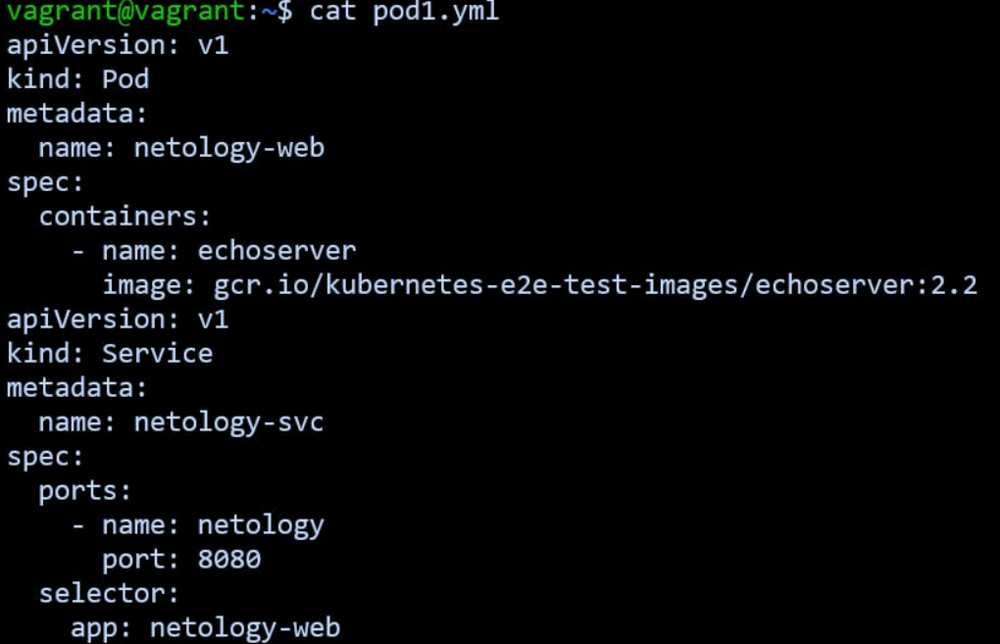

# Домашнее задание к занятию «Базовые объекты K8S»

### Цель задания

В тестовой среде для работы с Kubernetes, установленной в предыдущем ДЗ, необходимо развернуть Pod с приложением и подключиться к нему со своего локального компьютера. 

------

### Чеклист готовности к домашнему заданию

1. Установленное k8s-решение (например, MicroK8S).
2. Установленный локальный kubectl.
3. Редактор YAML-файлов с подключенным Git-репозиторием.

------

### Инструменты и дополнительные материалы, которые пригодятся для выполнения задания

1. Описание [Pod](https://kubernetes.io/docs/concepts/workloads/pods/) и примеры манифестов.
2. Описание [Service](https://kubernetes.io/docs/concepts/services-networking/service/).

------

### Задание 1. Создать Pod с именем hello-world

1. Создать манифест (yaml-конфигурацию) Pod.
2. Использовать image - gcr.io/kubernetes-e2e-test-images/echoserver:2.2.
3. Подключиться локально к Pod с помощью `kubectl port-forward` и вывести значение (curl или в браузере).

---


```
vagrant@vagrant:~$ kubectl port-forward netol-le 8080:8080
Forwarding from 127.0.0.1:8080 -> 8080
Forwarding from [::1]:8080 -> 8080
Handling connection for 8081
Handling connection for 8081
vagrant@vagrant:~$curl -l http://127.0.0.1:8081

Hostname: echoserver01

Pod Information:
        -no pod information available-

Server values:
        server_version=nginx: 1.12.2 - lua: 10010

Request Information:
        client_address=127.0.0.1
        method=GET
        real path=/
        query=
        request_version=1.1
        request_scheme=http
        request_uri=http://127.0.0.1:8080/

Request Headers:
        accept=*/*
        host=127.0.0.1:8081
        user-agent=curl/7.81.0

Request Body:
        -no body in request-
```


------

### Задание 2. Создать Service и подключить его к Pod

1. Создать Pod с именем netology-web.
2. Использовать image — gcr.io/kubernetes-e2e-test-images/echoserver:2.2.
3. Создать Service с именем netology-svc и подключить к netology-web.
4. Подключиться локально к Service с помощью `kubectl port-forward` и вывести значение (curl или в браузере).

------
---

```
vagrant@vagrant:~$ cat pod1.yml
apiVersion: v1
kind: Pod
metadata:
  name: netology-web
spec:
  containers:
    - name: echoserver
      image: gcr.io/kubernetes-e2e-test-images/echoserver:2.2
apiVersion: v1
kind: Service
metadata:
  name: netology-svc
spec:
  ports:
    - name: netology
      port: 8080
  selector:
    app: netology-web
```

```commandline
kubectl port-forward svc/netology-svc 10080:8080
Forwarding from 127.0.0.1:10080 -> 8080
Forwarding from [::1]:10080 -> 8080
Handling connection for 10080
```

```commandline
curl -l http://127.0.0.1:10080

Hostname: netology-web

Pod Information:
        -no pod information available-

Server values:
        server_version=nginx: 1.12.2 - lua: 10010

Request Information:
        client_address=127.0.0.1
        method=GET
        real path=/
        query=
        request_version=1.1
        request_scheme=http
        request_uri=http://127.0.0.1:8080/

Request Headers:
        accept=*/*
        host=127.0.0.1:10080
        user-agent=curl/7.81.0

Request Body:
        -no body in request-
```
```
vagrant@vagrant:~$ kubectl get pods
NAME                                   READY   STATUS             RESTARTS          AGE
nginx-77b4fdf86c-qtdnn                 1/1     Running            1 (30h ago)       4d20h
my-pod                                 1/1     Running            1 (30h ago)       3d23h
netology-web                           1/1     Running            1 (30h ago)       3d22h
```


### Правила приёма работы

1. Домашняя работа оформляется в своем Git-репозитории в файле README.md. Выполненное домашнее задание пришлите ссылкой на .md-файл в вашем репозитории.
2. Файл README.md должен содержать скриншоты вывода команд `kubectl get pods`, а также скриншот результата подключения.
3. Репозиторий должен содержать файлы манифестов и ссылки на них в файле README.md.

------

### Критерии оценки
Зачёт — выполнены все задания, ответы даны в развернутой форме, приложены соответствующие скриншоты и файлы проекта, в выполненных заданиях нет противоречий и нарушения логики.

На доработку — задание выполнено частично или не выполнено, в логике выполнения заданий есть противоречия, существенные недостатки.
