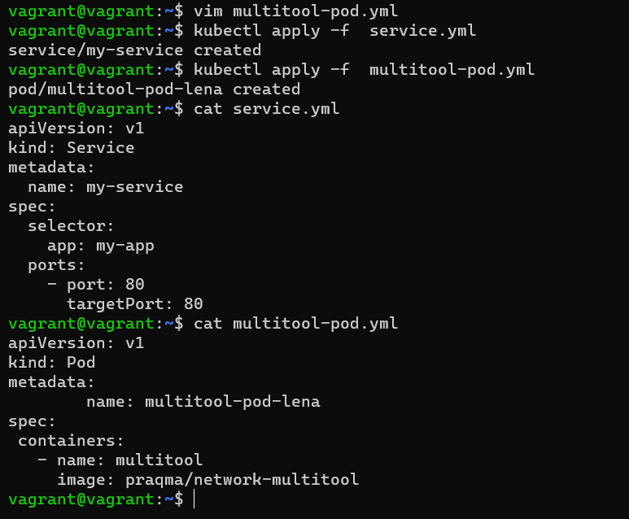
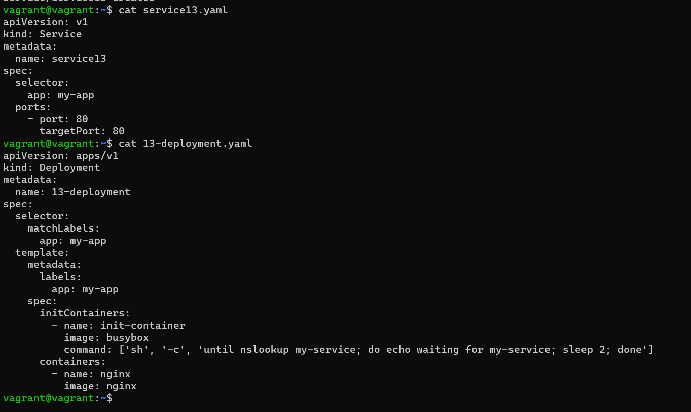

# Домашнее задание к занятию «Запуск приложений в K8S»

### Цель задания

В тестовой среде для работы с Kubernetes, установленной в предыдущем ДЗ, необходимо развернуть Deployment с приложением, состоящим из нескольких контейнеров, и масштабировать его.

------

### Чеклист готовности к домашнему заданию

1. Установленное k8s-решение (например, MicroK8S).
2. Установленный локальный kubectl.
3. Редактор YAML-файлов с подключённым git-репозиторием.

------

### Инструменты и дополнительные материалы, которые пригодятся для выполнения задания

1. [Описание](https://kubernetes.io/docs/concepts/workloads/controllers/deployment/) Deployment и примеры манифестов.
2. [Описание](https://kubernetes.io/docs/concepts/workloads/pods/init-containers/) Init-контейнеров.
3. [Описание](https://github.com/wbitt/Network-MultiTool) Multitool.

------

### Задание 1. Создать Deployment и обеспечить доступ к репликам приложения из другого Pod

1. Создать Deployment приложения, состоящего из двух контейнеров — nginx и multitool. Решить возникшую ошибку.
2.После запуска увеличить количество реплик работающего приложения до 2.
3.Продемонстрировать количество подов до и после масштабирования.


3. Создать Service, который обеспечит доступ до реплик приложений из п.1.


4. Создать отдельный Pod с приложением multitool и убедиться с помощью `curl`, что из пода есть доступ до приложений из п.1.

---
```commandline
vagrant@vagrant:~$ vim deployment.yml
vagrant@vagrant:~$ cat deployment.yml
apiVersion: apps/v1
kind: Deployment
metadata:
  name: le-deployment
spec:
  replicas: 2
  selector:
    matchLabels:
      app: my-app
  template:
    metadata:
      labels:
        app: my-app
    spec:
      containers:
        - name: nginx
          image: nginx
          ports:
            - containerPort: 80
        - name: multitool
          image: praqma/network-multitool
        
vagrant@vagrant:~$ kubectl apply -f deployment.yml
deployment.apps/le-deployment created
vagrant@vagrant:~$
vagrant@vagrant:~$
vagrant@vagrant:~$ kubectl get deployments
NAME            READY   UP-TO-DATE   AVAILABLE   AGE
le-deployment   2/2     2            0           12m
multitool       1/1     1            1           11m
vagrant@vagrant:~$
vagrant@vagrant:~$ kubectl get pods
NAME                             READY   STATUS             RESTARTS      AGE
netol-le                         1/1     Running            0             97m
le-deployment-67f696bb8f-w9fnt   2/2     Running            0             25m
le-deployment-67f696bb8f-nrlhr   2/2     Running            0             19m
multitool-5h7cbff84c-wn632       1/1     Running            0             18m
vagrant@vagrant:~$ kubectl get service
NAME           TYPE        CLUSTER-IP       EXTERNAL-IP   PORT(S)    AGE
kubernetes     ClusterIP   10.152.183.1     <none>        443/TCP    3h26m
netology-svc   ClusterIP   10.152.183.162   <none>        8080/TCP   88m
vagrant@vagrant:~$
```
до масштабирования:
```
vagrant@vagrant:~$ kubectl get pods
NAME                             READY   STATUS             RESTARTS         AGE
netol-le                         1/1     Running            0                95m
le-deployment-67f696bb8f-nrlhr   1/1     Running            0                19m
multitool-5h7cbff84c-wn632       1/1     Running            0                13m
vagrant@vagrant:~$


```
после масштабирования

```commandline
vagrant@vagrant:~$ kubectl get pods
NAME                             READY   STATUS             RESTARTS      AGE
netol-le                         1/1     Running            0             97m
le-deployment-67f696bb8f-w9fnt   2/2     Running            0             25m
le-deployment-67f696bb8f-nrlhr   2/2     Running            0             19m
multitool-5h7cbff84c-wn632       1/1     Running            0             18m

```


```commandline
vagrant@vagrant:~$ vim multitool-pod.yml
vagrant@vagrant:~$ kubectl apply -f  service.yml
service/my-service created
vagrant@vagrant:~$ kubectl apply -f  multitool-pod.yml
pod/multitool-pod-lena created
vagrant@vagrant:~$ cat service.yml
apiVersion: v1
kind: Service
metadata:
  name: my-service
spec:
  selector:
    app: my-app
  ports:
    - port: 80
      targetPort: 80
vagrant@vagrant:~$ cat multitool-pod.yml
apiVersion: v1
kind: Pod
metadata:
        name: multitool-pod-lena
spec:
 containers:
   - name: multitool
     image: praqma/network-multitool
vagrant@vagrant:~$
```
```
vagrant@vagrant:~$ kubectl exec multitool-5h7cbff84c-wn632 -- curl 10.0.2.15
<!DOCTYPE html>
<html>
<head>
<title>Welcome to nginx!</title>
<style>
    body {
        width: 35em;
        margin: 0 auto;
        font-family: Tahoma, Verdana, Arial, sans-serif;
    }
</style>
</head>
<body>
<h1>Welcome to nginx!</h1>
<p>If you see this page, the nginx web server is successfully installed and
working. Further configuration is required.</p>

<p>For online documentation and support please refer to
<a href="http://nginx.org/">nginx.org</a>.<br/>
Commercial support is available at
<a href="http://nginx.com/">nginx.com</a>.</p>

<p><em>Thank you for using nginx.</em></p>
</body>
</html>
  % Total    % Received % Xferd  Average Speed   Time    Time     Time  Current
                                 Dload  Upload   Total   Spent    Left  Speed
100   612  100   612    0     0   440k      0 --:--:-- --:--:-- --:--:--  597k
```
------

### Задание 2. Создать Deployment и обеспечить старт основного контейнера при выполнении условий

1. Создать Deployment приложения nginx и обеспечить старт контейнера только после того, как будет запущен сервис этого приложения.
2. Убедиться, что nginx не стартует. В качестве Init-контейнера взять busybox.
3. Создать и запустить Service. Убедиться, что Init запустился.
4. Продемонстрировать состояние пода до и после запуска сервиса.
---




```commandline
vagrant@vagrant:~$ kubectl get pods
NAME                             READY   STATUS             RESTARTS         AGE
netol-le                         1/1     Running            0                149m
multitool-pod-lena               1/1     Running            0                20m
13-deployment-5f69c9b6dd-dxj82   0/1     Init:0/1           0                7m46s
le-deployment-67f696bb8f-nrlhr   1/1     Running            0                72m
le-deployment-67f696bb8f-w9fnt   1/1     Running            0                78m
vagrant@vagrant:~$


vagrant@vagrant:~$ kubectl get pods
NAME                             READY   STATUS             RESTARTS         AGE
netol-le                         1/1     Running            0                159m
multitool-pod-lena               1/1     Running            0                30m
13-deployment-5f69c9b6dd-dxj82   1/1     Init:0/1           0                17m
le-deployment-67f696bb8f-nrlhr   1/1     Running            0                82m
le-deployment-67f696bb8f-w9fnt   1/1     Running            0                88m
vagrant@vagrant:~$
```


------

### Правила приема работы

1. Домашняя работа оформляется в своем Git-репозитории в файле README.md. Выполненное домашнее задание пришлите ссылкой на .md-файл в вашем репозитории.
2. Файл README.md должен содержать скриншоты вывода необходимых команд `kubectl` и скриншоты результатов.
3. Репозиторий должен содержать файлы манифестов и ссылки на них в файле README.md.

------
