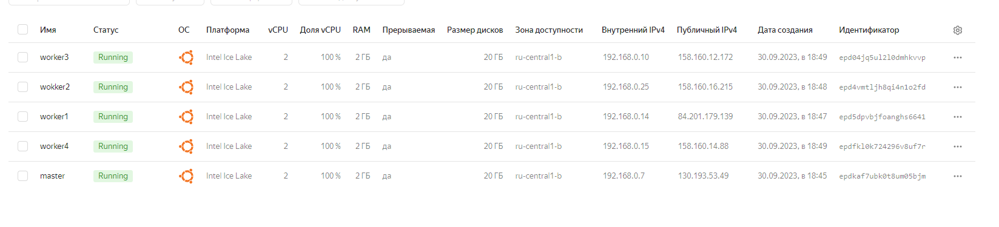

# Домашнее задание к занятию «Установка Kubernetes»

### Цель задания

Установить кластер K8s.

### Чеклист готовности к домашнему заданию

1. Развёрнутые ВМ с ОС Ubuntu 20.04-lts.


### Инструменты и дополнительные материалы, которые пригодятся для выполнения задания

1. [Инструкция по установке kubeadm](https://kubernetes.io/docs/setup/production-environment/tools/kubeadm/create-cluster-kubeadm/).
2. [Документация kubespray](https://kubespray.io/).

-----

### Задание 1. Установить кластер k8s с 1 master node

1. Подготовка работы кластера из 5 нод: 1 мастер и 4 рабочие ноды.
2. В качестве CRI — containerd.
3. Запуск etcd производить на мастере.
4. Способ установки выбрать самостоятельно.

---
Создала вм

```commandline
vagrant@vagrant:~/.ssh$ yc compute instance list
+----------------------+---------+---------------+---------+----------------+--------------+
|          ID          |  NAME   |    ZONE ID    | STATUS  |  EXTERNAL IP   | INTERNAL IP  |
+----------------------+---------+---------------+---------+----------------+--------------+
| epd04jq5ul2l0dmhkvvp | worker3 | ru-central1-b | RUNNING | 158.160.12.172 | 192.168.0.10 |
| epd4vmtljh8qi4n1o2fd | wokker2 | ru-central1-b | RUNNING | 158.160.16.215 | 192.168.0.25 |
| epd5dpvbjfoanghs6641 | worker1 | ru-central1-b | RUNNING | 84.201.179.139 | 192.168.0.14 |
| epdfkl0k724296v8uf7r | worker4 | ru-central1-b | RUNNING | 158.160.14.88  | 192.168.0.15 |
| epdkaf7ubk0t8um05bjm | master  | ru-central1-b | RUNNING | 130.193.53.49  | 192.168.0.7  |
+----------------------+---------+---------------+---------+----------------+--------------+

```
Kubernetes кластер инициализирован при помощи kubeadm:
```
vagrant@master:~$ sudo kubeadm init \
>  --apiserver-advertise-address=192.168.0.7 \
>  --pod-network-cidr 192.244.0.0/16 \
>  --apiserver-cert-extra-sans=130.193.53.49
[init] Using Kubernetes version: v1.28.2
[preflight] Running pre-flight checks
[preflight] Pulling images required for setting up a Kubernetes cluster
.
.
.

kubeadm join 192.168.0.7:6443 --token zj29tw.wftgam70p5a05q4s \
        --discovery-token-ca-cert-hash sha256:88decc11d6cf876b324fcab3f4701835cc501be9005ce311cae277f9ce480b67
```

Далее по с остальными рабочим 4вм делаем по аналогии и вводим на них команду,
присоеденяем к кластеру при помощи команды из вывода kubeadm init:
```commandline
vagrant@worker1:~$ sudo kubeadm join 192.168.0.7:6443 --token zj29tw.wftgam70p5a05q4s \
>         --discovery-token-ca-cert-hash sha256:88decc11d6cf876b324fcab3f4701835cc501be9005ce311cae277f9ce480b67
[preflight] Running pre-flight checks
[preflight] Reading configuration from the cluster...
[preflight] FYI: You can look at this config file with 'kubectl -n kube-system get cm kubeadm-config -o yaml'
[kubelet-start] Writing kubelet configuration to file "/var/lib/kubelet/config.yaml"
[kubelet-start] Writing kubelet environment file with flags to file "/var/lib/kubelet/kubeadm-flags.env"
[kubelet-start] Starting the kubelet
[kubelet-start] Waiting for the kubelet to perform the TLS Bootstrap...

This node has joined the cluster:
* Certificate signing request was sent to apiserver and a response was received.
* The Kubelet was informed of the new secure connection details.

Run 'kubectl get nodes' on the control-plane to see this node join the cluster.

vagrant@worker1:~$
```
```commandline
vagrant@master:~$ kubectl get nodes
NAME      STATUS   ROLES           AGE     VERSION
master    Ready    control-plane   4m41s   v1.28.2
wokker2   Ready    <none>          2m44s   v1.28.2
worker1   Ready    <none>          2m48s   v1.28.2
worker3   Ready    <none>          2m42s   v1.28.2
worker4   Ready    <none>          2m39s   v1.28.2
```

Запущенный в поднятом kubernetes под с nginx:
```commandline
vagrant@master:~$ kubectl get pod -o wide
NAME                     READY   STATUS              RESTARTS   AGE   IP             NODE      NOMINATED NODE   READINESS GATES
nginx-56fcf95486-6j2x7   1/1     Running             0          10m   192.168.0.15   worker4   <none>           <none>
nginx-56fcf95486-lddql   1/1     Running             0          10m   192.168.0.14   worker1   <none>           <none>
vagrant@master:~$

```

```commandline
vagrant@master:~$  kubectl get pods -n kube-system
NAME                             READY   STATUS              RESTARTS   AGE
coredns-5dd5756b68-z4dmp         1/1     Running             0          27m
coredns-5dd5756b68-znwg8         1/1     Running             0          27m
etcd-master                      1/1     Running             0          28m
kube-apiserver-master            1/1     Running             0          28m
kube-controller-manager-master   1/1     Running             0          28m
kube-proxy-5mgzh                 1/1     Running             0          26m
kube-proxy-88jfl                 1/1     Running             0          27m
kube-proxy-mmbrr                 1/1     Running             0          26m
kube-proxy-vw57z                 1/1     Running             0          26m
kube-proxy-xj5lq                 1/1     Running             0          26m
kube-scheduler-master            1/1     Running             0          28m
vagrant@master:~$
```
------

## Дополнительные задания (со звёздочкой)

**Настоятельно рекомендуем выполнять все задания под звёздочкой.** Их выполнение поможет глубже разобраться в материале.   
Задания под звёздочкой необязательные к выполнению и не повлияют на получение зачёта по этому домашнему заданию. 

### Задание 2*. Установить HA кластер

1. Установить кластер в режиме HA.
2. Использовать нечётное количество Master-node.
3. Для cluster ip использовать keepalived или другой способ.

### Правила приёма работы

1. Домашняя работа оформляется в своем Git-репозитории в файле README.md. Выполненное домашнее задание пришлите ссылкой на .md-файл в вашем репозитории.
2. Файл README.md должен содержать скриншоты вывода необходимых команд `kubectl get nodes`, а также скриншоты результатов.
3. Репозиторий должен содержать тексты манифестов или ссылки на них в файле README.md.
