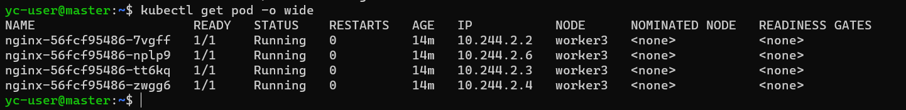

# Домашнее задание к занятию «Установка Kubernetes»

### Цель задания

Установить кластер K8s.

### Чеклист готовности к домашнему заданию

1. Развёрнутые ВМ с ОС Ubuntu 20.04-lts.


### Инструменты и дополнительные материалы, которые пригодятся для выполнения задания

1. [Инструкция по установке kubeadm](https://kubernetes.io/docs/setup/production-environment/tools/kubeadm/create-cluster-kubeadm/).
2. [Документация kubespray](https://kubespray.io/).

-----

### Задание 1. Установить кластер k8s с 1 master node

1. Подготовка работы кластера из 5 нод: 1 мастер и 4 рабочие ноды.
2. В качестве CRI — containerd.
3. Запуск etcd производить на мастере.
4. Способ установки выбрать самостоятельно.

---
Создала вм

```commandline

vagrant@vagrant:~$ yc compute instance list
+----------------------+---------+---------------+---------+---------------+-------------+
|          ID          |  NAME   |    ZONE ID    | STATUS  |  EXTERNAL IP  | INTERNAL IP |
+----------------------+---------+---------------+---------+---------------+-------------+
| ef3di3i5e9atmbb3elc4 | worker3 | ru-central1-c | RUNNING | 51.250.39.212 | 10.1.2.31   |
| ef3e5ej7dmeeec2vo0pv | worker4 | ru-central1-c | RUNNING | 51.250.41.238 | 10.1.2.3    |
| ef3knouark15umue2mg4 | worker2 | ru-central1-c | RUNNING | 51.250.45.126 | 10.1.2.14   |
| ef3t7hbun6tctarf868e | worker1 | ru-central1-c | RUNNING | 51.250.34.218 | 10.1.2.33   |
| ef3ti72k0b8g9ontr6ga | master  | ru-central1-c | RUNNING | 51.250.41.250 | 10.1.2.13   |
+----------------------+---------+---------------+---------+---------------+-------------+

vagrant@vagrant:~$

```
На мастере выполните инициализацию Kubernetes кластера, указав параметры для containerd и etcd:
```
root@master:/home/yc-user# ssudo kubeadm init --cri-socket /run/containerd/containerd.sock --pod-network-cidr=10.244.2.2 --apiserver-advertise-address=192.168.0.7 --control-plane-endpoint=130.193.53.49:6443 --upload-certs
.
.
.
kubeadm join 10.1.2.13:6443 --token lg2iox.sx5uwwzgyc98ccry \
        --discovery-token-ca-cert-hash sha256:e8566b3b84cdeb005d15f02c520080ced96ea9877c7d55e37defc35a953ed209
root@master:/home/yc-user#
```

Далее по с остальными рабочим 4вм делаем по аналогии и вводим на них команду,
присоеденяем к кластеру при помощи команды из вывода kubeadm init:
```commandline
yc-user@worker1:~$ sudo kubeadm join 10.1.2.13:6443 --token lg2iox.sx5uwwzgyc98ccry \
>         --discovery-token-ca-cert-hash sha256:e8566b3b84cdeb005d15f02c520080ced96ea9877c7d55e37defc35a953ed209
preflight] Running pre-flight checks
[preflight] Reading configuration from the cluster...
[preflight] FYI: You can look at this config file with 'kubectl -n kube-system get cm kubeadm-config -o yaml'
[kubelet-start] Writing kubelet configuration to file "/var/lib/kubelet/config.yaml"
[kubelet-start] Writing kubelet environment file with flags to file "/var/lib/kubelet/kubeadm-flags.env"
[kubelet-start] Starting the kubelet
[kubelet-start] Waiting for the kubelet to perform the TLS Bootstrap...

This node has joined the cluster:
* Certificate signing request was sent to apiserver and a response was received.
* The Kubelet was informed of the new secure connection details.

Run 'kubectl get nodes' on the control-plane to see this node join the cluster.


yc-user@worker1:~$
```
kubectl apply -f https://raw.githubusercontent.com/coreos/flannel/master/Documentation/kube-flannel.yml

```commandline
yc-user@master:~$ kubectl get nodes
NAME      STATUS   ROLES           AGE     VERSION
master    Ready    control-plane   9m59s   v1.28.2
worker1   Ready    <none>          5m12s   v1.28.2
worker2   Ready    <none>          9m5s    v1.28.2
worker3   Ready    <none>          8m58s   v1.28.2
worker4   Ready    <none>          8m50s   v1.28.2
yc-user@master:~$
```

Запущенный в поднятом kubernetes под с nginx:
```commandline
yc-user@master:~$ kubectl create deploy nginx --image=nginx:latest --replicas=4
deployment.apps/nginx created

vagrant@master:~$ kubectl get pod -o wide

```


------

## Дополнительные задания (со звёздочкой)

**Настоятельно рекомендуем выполнять все задания под звёздочкой.** Их выполнение поможет глубже разобраться в материале.   
Задания под звёздочкой необязательные к выполнению и не повлияют на получение зачёта по этому домашнему заданию. 

### Задание 2*. Установить HA кластер

1. Установить кластер в режиме HA.
2. Использовать нечётное количество Master-node.
3. Для cluster ip использовать keepalived или другой способ.

### Правила приёма работы

1. Домашняя работа оформляется в своем Git-репозитории в файле README.md. Выполненное домашнее задание пришлите ссылкой на .md-файл в вашем репозитории.
2. Файл README.md должен содержать скриншоты вывода необходимых команд `kubectl get nodes`, а также скриншоты результатов.
3. Репозиторий должен содержать тексты манифестов или ссылки на них в файле README.md.
