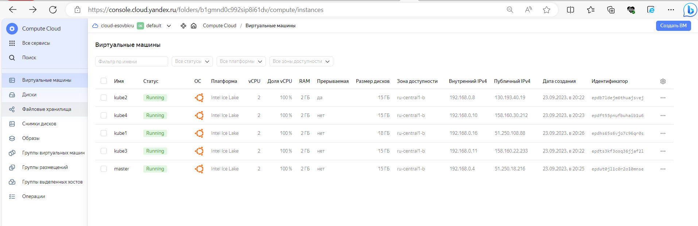
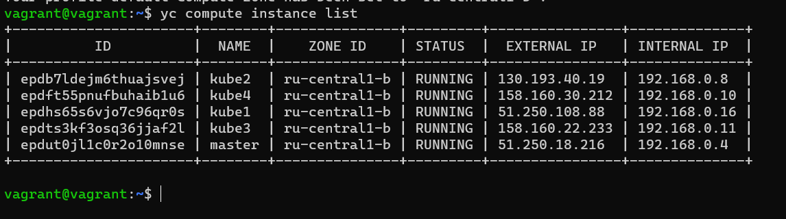
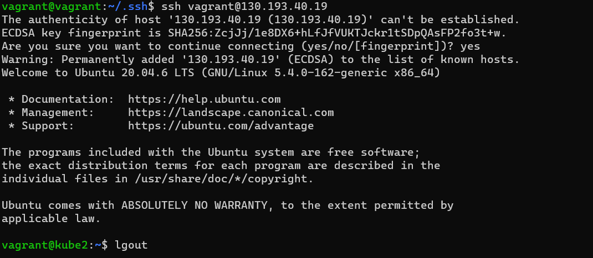
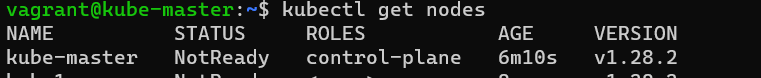
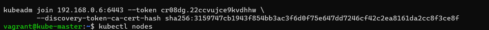
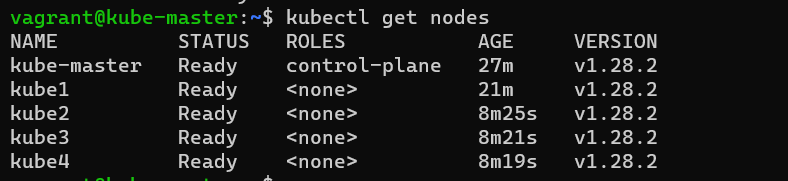
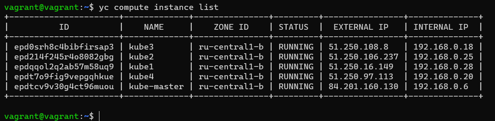

# Домашнее задание к занятию «Установка Kubernetes»

### Цель задания

Установить кластер K8s.

### Чеклист готовности к домашнему заданию

1. Развёрнутые ВМ с ОС Ubuntu 20.04-lts.


### Инструменты и дополнительные материалы, которые пригодятся для выполнения задания

1. [Инструкция по установке kubeadm](https://kubernetes.io/docs/setup/production-environment/tools/kubeadm/create-cluster-kubeadm/).
2. [Документация kubespray](https://kubespray.io/).

-----

### Задание 1. Установить кластер k8s с 1 master node

1. Подготовка работы кластера из 5 нод: 1 мастер и 4 рабочие ноды.
2. В качестве CRI — containerd.
3. Запуск etcd производить на мастере.
4. Способ установки выбрать самостоятельно.
`
---`
Создала вм


проверяем есть ли доступ на них, на примере одной:

т.к виртуалки останавливала(делала не один день), то при перезапуске айпишники другие, но не стала переделыватьскрины выше.
```commandline
vagrant@kube-master:~$ sudo kubeadm init \
 --apiserver-advertise-address=192.168.0.29 \
 --pod-network-cidr 10.244.0.0/16 \
 --apiserver-cert-extra-sans=130.193.54.154
[init] Using Kubernetes version: v1.28.2
.
.
.
.
kubeadm join 192.168.0.29:6443 --token z7h10u.smqvq8gs28izjae2 \
        --discovery-token-ca-cert-hash sha256:0def1ba160ea4549bd1362d3255bce4207ef8923da64e0a9893ad2551efd27d8
vagrant@kube-master:~$
```
антивирус блокировал :(


Далее по с остальными рабочим 4вм делаем по аналогии и вводим на них команду
```commandline
vagrant@kube1:~$ sudo kubeadm join 192.168.0.6:6443 --token cr08dg.22ccvujce9kvdhhw         --discovery-token-ca-cert-hash sha256:3159747cb1943f854bb3ac3f6d
0f75e647dd7246cf42c2ea8161da2cc8f3ce8f
[preflight] Running pre-flight checks
[preflight] Reading configuration from the cluster...
[preflight] FYI: You can look at this config file with 'kubectl -n kube-system get cm kubeadm-config -o yaml'
[kubelet-start] Writing kubelet configuration to file "/var/lib/kubelet/config.yaml"
[kubelet-start] Writing kubelet environment file with flags to file "/var/lib/kubelet/kubeadm-flags.env"
[kubelet-start] Starting the kubelet
[kubelet-start] Waiting for the kubelet to perform the TLS Bootstrap...

This node has joined the cluster:
* Certificate signing request was sent to apiserver and a response was received.
* The Kubelet was informed of the new secure connection details.

Run 'kubectl get nodes' on the control-plane to see this node join the cluster.

vagrant@kube1:~$
```



------

## Дополнительные задания (со звёздочкой)

**Настоятельно рекомендуем выполнять все задания под звёздочкой.** Их выполнение поможет глубже разобраться в материале.   
Задания под звёздочкой необязательные к выполнению и не повлияют на получение зачёта по этому домашнему заданию. 

### Задание 2*. Установить HA кластер

1. Установить кластер в режиме HA.
2. Использовать нечётное количество Master-node.
3. Для cluster ip использовать keepalived или другой способ.

### Правила приёма работы

1. Домашняя работа оформляется в своем Git-репозитории в файле README.md. Выполненное домашнее задание пришлите ссылкой на .md-файл в вашем репозитории.
2. Файл README.md должен содержать скриншоты вывода необходимых команд `kubectl get nodes`, а также скриншоты результатов.
3. Репозиторий должен содержать тексты манифестов или ссылки на них в файле README.md.
